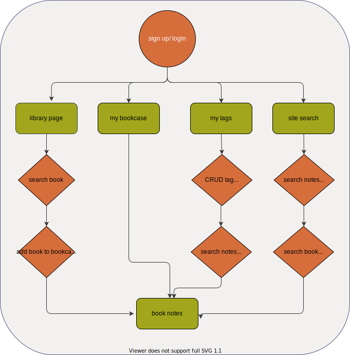

# Bookia

  
  
  

A Books and notes management website designed for writers to improve their work efficiency by taking notes, categorize note's tag and searching for inspiration easily.

Link: https://bookia-280d8.web.app/

# Technologies

### Front-End Fundamental

- HTML / CSS
- JavaScript
- Responsive Web Design

### Frameworks

- React
- Hooks
- React Router
- styled components

### Firebase

- Authentication
- cloud Firestore
- Hosting

### Packages

- react-html-parser
- CKEditor 5  
   

# Features

- Search book from google books API and add book to bookcase

  

   

- Create new note with editor and add not's tag of the book.

  

   

- Click tag to filter notes. Click on the note to enter the book information page

  

   

- CRUD tags and tag group for management.

  

 

# Flow Chart

 

# Future Features

- Drag and drop of tag
- Create story board by notes and ideas

# Contact

Look forward to your feedbacks and suggestions!

Email： a31420o@gmail.com
